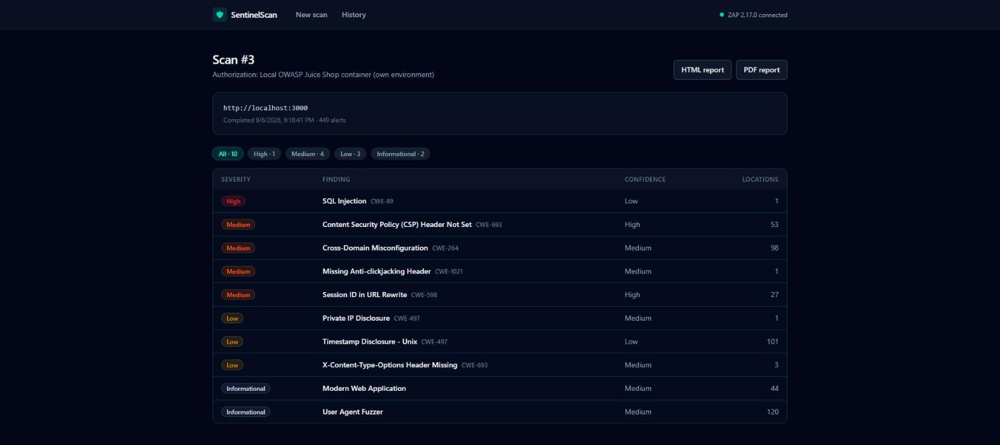
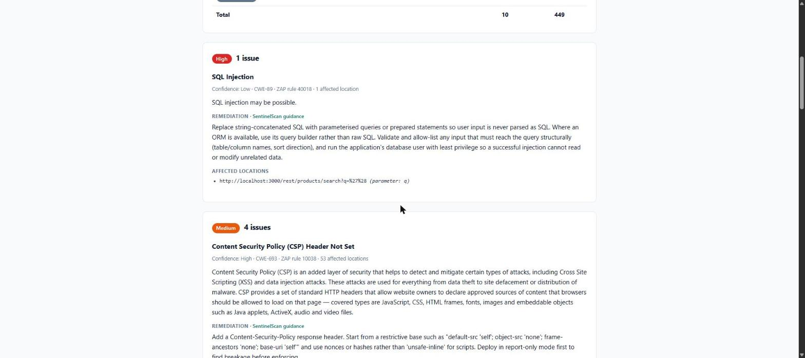
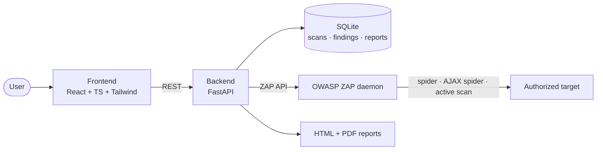

# SentinelScan

A full-stack web application security scanner. SentinelScan drives [OWASP ZAP](https://www.zaproxy.org/) — the industry-standard open-source DAST engine — through a crawl and active-scan pipeline, stores the results, and turns them into styled HTML and PDF vulnerability reports with severity ratings and remediation guidance.

SentinelScan is not a hand-rolled exploit engine. It is the orchestration, persistence, and reporting layer around ZAP's real scanning engine, so the engineering focus is where it belongs: async job orchestration, a live-progress GUI, a normalized findings model, and an automated reporting pipeline.

   

## ⚠️ Ethical use

SentinelScan performs **active scanning** — it sends real attack traffic and can disrupt a target. Every scan requires an explicit authorization confirmation, enforced in the UI *and* re-checked server-side in `POST /api/scans`, and the confirmation is stored on the scan record as an audit trail.

**Only scan systems you own or have explicit written authorization to test.** Unauthorized scanning is illegal in most jurisdictions. Development and testing of this project is done exclusively against deliberately-vulnerable practice applications running locally (see [Test targets](#test-targets)).

## Screenshots

Findings from a scan of a local OWASP Juice Shop container, grouped by issue and filterable by severity:



The generated HTML report, with curated remediation guidance:



## Features

- **Real scan engine** — ZAP spider, browser-driven AJAX spider, and active scan, orchestrated as a background job with phase-by-phase progress.
- **SPA-aware crawling** — the traditional spider cannot execute JavaScript, so single-page apps expose almost no attack surface to the active scanner. SentinelScan adds a headless-Chrome AJAX spider phase, which is what surfaces the REST endpoints behind an Angular/React front end.
- **Live progress GUI** — React dashboard polls scan status and shows the current phase, progress, and a per-severity breakdown as results land.
- **Findings triage** — alerts are grouped by issue rather than listed once per affected URL, filterable by severity, expandable to description, remediation, and affected locations.
- **Automated reports** — one shared findings context renders to a self-contained HTML report *and* a natively authored PDF (ReportLab, no external binaries).
- **Curated remediation knowledge base** — ~28 ZAP rule IDs mapped to specific, actionable remediation guidance, falling back to ZAP's own text for anything uncurated.
- **Authorization gate** — enforced client-side and server-side, recorded per scan.
- **Scan history** — every scan, its status, and its severity breakdown persisted in SQLite.

## Architecture



A scan moves through the pipeline in `backend/app/services/scan_orchestrator.py`:

```
pending → spidering (spider + AJAX spider) → active_scanning → completed
```

Each scan starts a fresh ZAP session, because ZAP accumulates alerts per session and one scan's findings must not leak into another's. Scans are therefore serialized; a second concurrent request gets a `409`.

### Layout

```
backend/
  app/
    main.py                       FastAPI app, CORS, router registration
    config.py                     pydantic-settings configuration
    db/models.py                  Scan, Finding, Report
    routers/                      health, scans, findings, reports
    services/
      zap_client.py               ZAP API client wrapper
      scan_orchestrator.py        spider → AJAX spider → active scan → persist
      severity_mapping.py         ZAP risk/confidence → internal enums
      remediation_kb.py           curated remediation guidance by ZAP rule id
      report_generator.py         shared context → Jinja2 HTML + ReportLab PDF
    templates/report.html.j2      self-contained HTML report
  tests/
frontend/
  src/
    api/                          typed API client
    hooks/                        polling hooks for status, findings, history
    components/                   AuthorizationGate, FindingsTable, SeverityBadge, …
    pages/                        NewScan, ScanDetail, History
scripts/start-zap.ps1             launches the ZAP daemon correctly
```

## Prerequisites

| Tool | Version | Windows install |
|---|---|---|
| Python | 3.11+ | already present on most systems (use `py -3` if bare `python` hits the Store alias) |
| Node.js | LTS | `winget install OpenJS.NodeJS.LTS` |
| JDK | 17 | `winget install Microsoft.OpenJDK.17` |
| OWASP ZAP | 2.17+ | `winget install ZAP.ZAP` |
| Google Chrome | any recent | needed by the AJAX spider (headless) |
| Docker Desktop | latest | `winget install Docker.DockerDesktop` — only for the practice targets |

## Running it

### One-click start (Windows)

Run once, to create a single Desktop shortcut:

```powershell
.\scripts\install-shortcuts.ps1
```

(Re-running this after upgrading from an older version of SentinelScan also removes the old **Start SentinelScan** / **Stop SentinelScan** shortcut pair it used to create.)

Then double-click **SentinelScan** on the Desktop (or right-click it → *Pin to taskbar* for one-click access anywhere). It opens a small control-panel window with a single button:

- Click **Start SentinelScan** to start ZAP, the backend, and the frontend — all hidden, with output going to `scripts\.run\logs\` — and wait until the backend actually confirms it is connected to ZAP (via `/api/zap/status`, not just ZAP's own readiness). The button shows **Starting…** while this happens (up to ~3 minutes on a cold start, mostly ZAP's JVM warm-up); once everything is up, `http://localhost:5173` opens in your browser and the window switches to showing **Stop SentinelScan**.
- Click **Stop SentinelScan** to shut everything down again; the window switches back to **Start SentinelScan** once all three services have exited.

If the control panel is opened while SentinelScan is already running (e.g. left running from a previous session), it detects this and opens straight to the **Stop SentinelScan** state instead of assuming everything is stopped.

Closing the control-panel window does **not** stop SentinelScan — it's just a UI for the start/stop scripts, not the services themselves. Use the **Stop SentinelScan** button (or `.\scripts\stop-all.ps1`) to actually shut things down.

If something fails to start or stop, the window shows a short error pointing at the relevant log file under `scripts\.run\logs\`.

The launcher assumes the one-time setup below has already been done (venv + dependencies, `.env` files, `npm install`); it checks for those and tells you what is missing rather than installing anything itself.

### Or run it manually

For visible per-service output and more control, run the three services yourself:

**1. Start the ZAP daemon.**

```powershell
.\scripts\start-zap.ps1 -ApiKey sentinelscan-dev-key
```

The script exists because ZAP's bundled `zap.bat` resolves its jar relative to the current working directory, and its default 512 MB heap gets the daemon killed by ZAP's own memory watchdog partway through a crawl plus active scan. The script launches the jar from the install directory with a 2 GB heap and waits until the API answers.

**2. Start the backend.**

```powershell
cd backend
py -3 -m venv .venv
.venv\Scripts\Activate.ps1
pip install -r requirements.txt
copy .env.example .env      # set ZAP_API_KEY to match step 1
uvicorn app.main:app --reload --port 8000
```

Check `http://localhost:8000/api/health` and `http://localhost:8000/api/zap/status`; interactive API docs are at `http://localhost:8000/docs`.

**3. Start the frontend.**

```powershell
cd frontend
npm install
copy .env.example .env
npm run dev
```

Open `http://localhost:5173`. The nav bar shows a live ZAP connection indicator.

### Configuration

`backend/.env` (see `.env.example`):

| Setting | Default | Purpose |
|---|---|---|
| `ZAP_HOST` / `ZAP_PORT` | `127.0.0.1` / `8080` | where the ZAP daemon listens |
| `ZAP_API_KEY` | — | must match the key ZAP was started with |
| `DATABASE_URL` | `sqlite:///./sentinelscan.db` | scan history storage |
| `CORS_ORIGINS` | `http://localhost:5173` | allowed frontend origins |
| `SPIDER_MAX_DURATION_MINS` | `2` | time box for the traditional spider |
| `AJAX_SPIDER_MAX_DURATION_MINS` | `3` | time box for the browser-driven crawl |
| `ASCAN_MAX_DURATION_MINS` | `10` | time box for the active scan |
| `AJAX_SPIDER_BROWSER` | `chrome-headless` | AJAX spider browser (`firefox-headless`, `htmlunit`, …) |

Scans are time-boxed so a run against a large target stays practical; raise the limits for a thorough assessment.

## Test targets

Run deliberately-vulnerable practice applications locally — never point the scanner at a site you do not control:

```bash
docker run -d -p 3000:3000 --name juice-shop bkimminich/juice-shop     # OWASP Juice Shop
docker run -d -p 4280:80   --name dvwa       vulnerables/web-dvwa      # DVWA
docker run -d -p 8085:8080 --name webgoat    webgoat/webgoat           # WebGoat
docker run -d -p 8086:80   --name bwapp      raesene/bwapp             # bWAPP
```

- **Juice Shop** (`http://localhost:3000`) needs no setup — the primary development target.
- **DVWA** (`http://localhost:4280`) and **bWAPP** (`http://localhost:8086`) need a one-time "Create / Reset Database" step in their own web UI.
- **WebGoat** (`http://localhost:8085/WebGoat`) requires creating an account on first visit.

## API

| Method | Endpoint | Purpose |
|---|---|---|
| `GET` | `/api/health` | liveness |
| `GET` | `/api/zap/status` | ZAP reachability and version |
| `POST` | `/api/scans` | start a scan (rejects unconfirmed authorization with `400`) |
| `GET` | `/api/scans` | scan history with per-severity counts |
| `GET` | `/api/scans/{id}` | scan detail |
| `GET` | `/api/scans/{id}/status` | lightweight polling endpoint |
| `GET` | `/api/scans/{id}/findings` | findings, optionally `?risk=High` |
| `POST` | `/api/scans/{id}/report?format=html\|pdf` | generate a report |
| `GET` | `/api/scans/{id}/report/{format}` | download a report |
| `DELETE` | `/api/scans/{id}` | delete a scan and its findings |

## Tests

```powershell
cd backend
.venv\Scripts\Activate.ps1
pytest
```

Covers severity mapping, the remediation knowledge base, report grouping and rendering (including HTML escaping of attacker-influenced finding content), and the API's authorization gate and validation.

## Design notes

- **Why wrap ZAP instead of writing the scanner?** A hand-rolled scanner would be a worse scanner and a legal liability. Wrapping a mature engine puts the effort into orchestration, data modeling, and reporting — and mirrors how real security tooling is built.
- **Why no Alembic?** Schema is created with `create_all` on startup. For a single-file SQLite database with no production deployment, migrations would be ceremony; this is a deliberate trade-off, not an oversight.
- **Why group findings by name?** ZAP reports one alert per affected URL, so a single missing header can appear 60 times. Reports and the UI group by issue with a location count, which is how a human actually triages.
- **Why time-box scans?** An unbounded active scan against a large target can run for hours. Configurable ceilings keep the tool usable, with the trade-off documented rather than hidden.

## Roadmap

- WebSocket push for scan progress instead of polling
- Authenticated scanning (session/context configuration in ZAP)
- Scan comparison between runs to track remediation over time
- GitHub Actions CI for backend tests and frontend build

## License

MIT — see [LICENSE](LICENSE).
