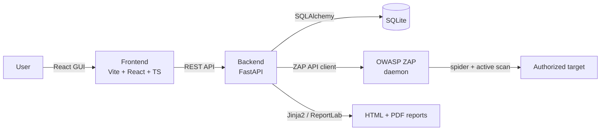

# SentinelScan

A full-stack web application security scanner: a React GUI and FastAPI backend that orchestrate [OWASP ZAP](https://www.zaproxy.org/) — the industry-standard open-source DAST scanner — to spider and actively scan a target, then automatically generate styled HTML and PDF vulnerability reports with severity ratings and remediation guidance.

SentinelScan is not a hand-rolled exploit engine. It's an orchestration, persistence, and reporting layer built on top of ZAP's real scanning engine — the project's focus is full-stack engineering: async job orchestration, data modeling, a live-progress GUI, and an automated reporting pipeline.

> **This project is under active development.** Architecture and setup instructions below are being filled in as each phase lands.

## ⚠️ Ethical use

SentinelScan performs **active scanning**, which sends real requests designed to surface vulnerabilities and can be disruptive to a target. Every scan requires an explicit authorization confirmation (enforced both in the UI and by the backend API) before it will run.

**Only scan targets you own or have explicit written authorization to test.** Scanning third-party systems without authorization is illegal in most jurisdictions. This repo's own development and testing is done exclusively against known, deliberately-vulnerable practice applications (see below) — never against real third-party sites.

## Architecture



- **Backend** (`backend/`): FastAPI app that orchestrates a ZAP daemon via its REST API (spider → active scan → alert retrieval), persists scans/findings to SQLite, and generates reports.
- **Frontend** (`frontend/`): React + Vite + TypeScript + Tailwind CSS dashboard for launching scans, watching live progress, browsing findings, and downloading reports.
- **Scan engine**: [OWASP ZAP](https://www.zaproxy.org/), run as a local daemon and driven via the `zaproxy` Python client.
- **Reports**: a shared findings context renders to both a self-contained HTML report (Jinja2) and a native PDF (ReportLab) — no external binary dependencies.

## Prerequisites

| Tool | Version | Install |
|---|---|---|
| Python | 3.11+ | already present on most systems; on Windows use `py -3` if bare `python` hits the Store alias |
| Node.js | LTS | `winget install OpenJS.NodeJS.LTS` |
| JDK | 11+ | `winget install Microsoft.OpenJDK.17` |
| OWASP ZAP | 2.17+ | `winget install ZAP.ZAP` |
| Docker Desktop | latest | `winget install Docker.DockerDesktop` (used for test targets, not required at runtime) |

## Test targets

Development and manual testing is done against known, deliberately-vulnerable applications, run locally via Docker — never against a real site:

```bash
docker run -d -p 3000:3000 --name juice-shop bkimminich/juice-shop     # OWASP Juice Shop
docker run -d -p 4280:80   --name dvwa       vulnerables/web-dvwa      # DVWA
docker run -d -p 8085:8080 --name webgoat    webgoat/webgoat           # WebGoat
docker run -d -p 8086:80   --name bwapp      raesene/bwapp             # bWAPP
```

- **Juice Shop** (`http://localhost:3000`) needs no setup — used as the primary scan target during development.
- **DVWA** (`http://localhost:4280`) and **bWAPP** (`http://localhost:8086`) require a one-time "Create / Reset Database" step from their own web UI on first load.
- **WebGoat** (`http://localhost:8085/WebGoat`) requires creating an account on first visit.

## Running it locally

Setup and run instructions will be filled in as the backend and frontend are built out (see build log in commit history).

## Project status

Built in stages, each independently verified — see commit history for the build log (environment setup → backend health check → data models → ZAP orchestration → report generation → frontend).

## License

MIT — see [LICENSE](LICENSE).
